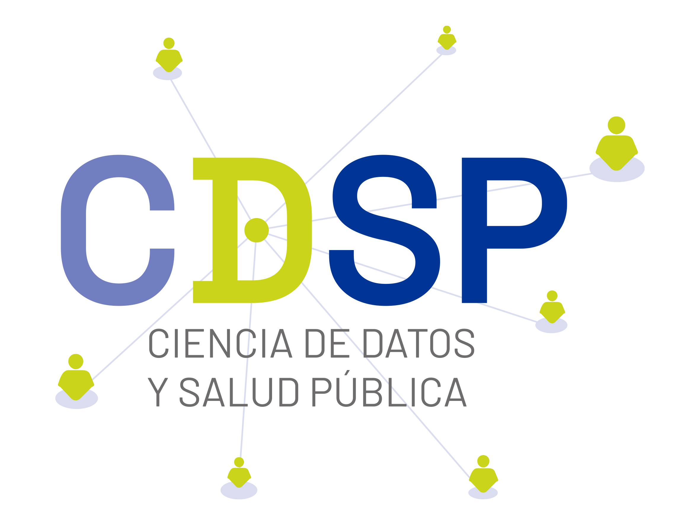

<!-- README.md is generated from README.Rmd. Please edit that file -->

# ciecl 

**Grupo de Ciencia de Datos para la Salud Publica** | Universidad de Chile

<!-- badges: start -->
[](https://lifecycle.r-lib.org/articles/stages.html#maturing)
[](https://CRAN.R-project.org/package=ciecl)
[](https://github.com/RodoTasso/ciecl/actions/workflows/R-CMD-check.yaml)
[](https://github.com/RodoTasso/ciecl)
<!-- badges: end -->

**Clasificacion Internacional de Enfermedades (CIE-10) oficial de Chile
para R**.

Paquete especializado para busqueda, validacion y analisis de codigos
CIE-10 en el contexto chileno. Incluye **39,873 codigos** (categorias y
subcategorias) del catalogo oficial MINSAL/DEIS v2018, con busqueda 
optimizada, calculo de comorbilidades y acceso a la API CIE-11 de la OMS.

## Finalidad

`ciecl` facilita el trabajo con codigos CIE-10 en investigacion y
analisis de datos de salud en Chile, eliminando la necesidad de
manipular archivos Excel manualmente y proporcionando herramientas
especializadas para:

- Validacion rapida de codigos diagnosticos
- Busqueda tolerante a errores (fuzzy search)
- Calculo automatico de indices de comorbilidad (Charlson, Elixhauser)
- Consultas SQL optimizadas sobre mas de 39 mil codigos
- Expansion de categorias a subcategorias (ej: E11 -> E11.0, E11.1, ..., E11.9)

## Por que usar ciecl 

### Ventajas:

1.  **Rendimiento**: Base de datos SQLite con FTS5 (Full-Text Search) - busquedas 100x mas rapidas que Excel
2.  **Integracion nativa**: Funciona directamente en R sin dependencias externas pesadas
3.  **Fuzzy search**: Encuentra "neumonia bactereana" aunque este mal escrito (tolera errores tipograficos)
4.  **Validacion vectorizada**: Procesa miles de codigos en milisegundos
5.  **Normalizacion automatica**: Acepta E110, E11.0, e11.0 indistintamente
6.  **Sin errores de encoding**: Los archivos XLSX tienen problemas con tildes y n en diferentes sistemas
7.  **Reproducibilidad**: Version controlada del catalogo CIE-10 (no cambia entre computadores)
8.  **Comorbilidades predefinidas**: Mapeos Charlson/Elixhauser listos para usar
9.  **API CIE-11**: Acceso directo a la clasificacion internacional actualizada
10. **Cache inteligente**: Guarda consultas frecuentes para mayor velocidad

### Ejemplo comparativo:

``` r
# Con XLSX (lento, manual, propenso a errores)
library(readxl)
cie10 <- read_excel("CIE-10.xlsx")
diabete_codes <- cie10[grepl("diabetes", tolower(cie10$descripcion)), ]

# Con ciecl (rapido, robusto, con cache)
library(ciecl)
diabete_codes <- cie_search("diabetes")
```

## Caracteristicas principales

- **39,873 codigos CIE-10**: Catalogo oficial MINSAL/DEIS v2018 completo
- **Busqueda fuzzy**: Algoritmo Jaro-Winkler para tolerar errores de escritura
- **SQL directo**: Acceso completo a la base de datos para consultas complejas
- **Vectorizacion**: Procesa miles de codigos simultaneamente
- **Cache SQLite**: Almacena resultados frecuentes para consultas instantaneas
- **Comorbilidades**: Mapeos validados de Charlson y Elixhauser
- **Expansion jerarquica**: Obtiene todos los subcodes de una categoria
- **API CIE-11**: Busqueda en la clasificacion internacional actualizada (OMS)
- **Dependencias minimas**: Solo 8 paquetes obligatorios para funcionalidad core

## Instalacion

### Todas las plataformas (Windows, macOS, Linux)

``` r
# Desde GitHub
# install.packages("pak")
pak::pak("RodoTasso/ciecl")

# Alternativa con devtools
devtools::install_github("RodoTasso/ciecl")

# Instalacion completa (incluye paquetes opcionales)
pak::pak("RodoTasso/ciecl", dependencies = TRUE)
```

### Requisitos del sistema por plataforma

#### Windows

No requiere dependencias adicionales del sistema. La instalacion funciona directamente.

#### macOS

Asegurate de tener las Xcode Command Line Tools instaladas:

``` bash
xcode-select --install
```

#### Linux (Ubuntu/Debian)

``` bash
# Dependencias para compilar paquetes R
sudo apt-get update
sudo apt-get install -y \
  r-base-dev \
  libcurl4-openssl-dev \
  libssl-dev \
  libxml2-dev
```

#### Linux (Fedora/RHEL/CentOS)

``` bash
sudo dnf install -y \
  R-devel \
  libcurl-devel \
  openssl-devel \
  libxml2-devel
```

**Nota**: El paquete tiene **dependencias minimas** para funcionalidad
core. Paquetes adicionales solo se requieren para funciones especificas.
Ver [DEPENDENCIAS.md](https://github.com/Rodotasso/ciecl/blob/main/DEPENDENCIAS.md) para detalles.

## Uso rapido

``` r
library(ciecl)

# Busqueda exacta (soporta multiples formatos)
cie_lookup("E11.0")   # Con punto
cie_lookup("E110")    # Sin punto
cie_lookup("E11")     # Solo categoria

# Vectorizado - multiples codigos
cie_lookup(c("E11.0", "I10", "Z00"))

# Con descripcion completa formateada
cie_lookup("E110", descripcion_completa = TRUE)

# Extraer codigo de texto con prefijos/sufijos (solo codigo escalar)
cie_lookup("CIE:E11.0", extract = TRUE)       # Retorna E11.0
cie_lookup("E11.0-confirmado", extract = TRUE) # Retorna E11.0
cie_lookup("dx-G20", extract = TRUE)          # Retorna G20
# Nota: extract=TRUE solo funciona con códigos escalares, use FALSE para vectores

# Fuzzy search con errores tipograficos
cie_search("diabetis mellitus")  # Encuentra "diabetes mellitus"

# Busqueda por siglas medicas (88 siglas soportadas)
cie_search("IAM")   # Infarto Agudo del Miocardio
cie_search("TBC")   # Tuberculosis
cie_search("DM2")   # Diabetes Mellitus tipo 2
cie_search("EPOC")  # Enfermedad Pulmonar Obstructiva Cronica
cie_search("HTA")   # Hipertension Arterial

# Ver todas las siglas disponibles
cie_siglas()

# SQL directo
cie10_sql("SELECT * FROM cie10 WHERE codigo LIKE 'E11%' LIMIT 3")

# Comorbilidades (requiere: install.packages("comorbidity"))
df %>% cie_comorbid(id = "paciente", code = "diagnostico", map = "charlson")
```

## Configuracion CIE-11 (opcional)

Para usar `cie11_search()` y acceder a la clasificacion internacional
actualizada, necesitas credenciales gratuitas de la OMS:

### Paso 1: Obtener credenciales

1.  Visita <https://icd.who.int/icdapi>
2.  Registrate con tu email (proceso gratuito)
3.  Obtendras un `Client ID` y `Client Secret`

### Paso 2: Configurar en R

**Opcion A: Variable de entorno (recomendado)**

Crea un archivo `.Renviron` en tu directorio de trabajo o home:

``` r
# En .Renviron
ICD_API_KEY=tu_client_id:tu_client_secret
```

**Opcion B: En cada sesion**

``` r
Sys.setenv(ICD_API_KEY = "tu_client_id:tu_client_secret")
```

### Paso 3: Usar CIE-11

``` r
library(ciecl)

# Buscar en CIE-11 (requiere httr2)
cie11_search("diabetes mellitus", max_results = 5)
#> # A tibble: 5 x 3
#>   codigo  titulo                                    capitulo
#>   <chr>   <chr>                                     <chr>
#> 1 5A14    Diabetes mellitus, tipo no especificado   05
#> 2 5A11    Diabetes mellitus tipo 2                  05
#> 3 5A10    Diabetes mellitus tipo 1                  05
```

**Nota**: CIE-11 es opcional. Todas las funciones core (CIE-10)
funcionan sin API key.

## Datos

Basado en el catalogo oficial **CIE-10 MINSAL/DEIS v2018**:

- **Fuente**: [Departamento de Estadisticas e Informacion de Salud (DEIS)](https://deis.minsal.cl)
- **Centro FIC Chile**: <https://deis.minsal.cl/centrofic/>
- **Repositorio documentos**: <https://repositoriodeis.minsal.cl>

Los datos CIE-10 son de uso publico segun el [Decreto 356 Exento (2017)](https://www.bcn.cl/leychile/navegar?i=1112064)
del Ministerio de Salud que establece el uso oficial de la CIE-10 en Chile.

## Desarrollo

Este paquete fue desarrollado con asistencia de Claude (Anthropic),
con verificacion y validacion humana de todo el codigo y documentacion.

## Contribuir

Las contribuciones son bienvenidas:

- Reporta errores en [GitHub Issues](https://github.com/RodoTasso/ciecl/issues)
- Sugiere mejoras o nuevas funcionalidades
- Envia pull requests

## Licencia

MIT (codigo del paquete) + datos CIE-10 MINSAL de uso publico

## Autor

**Rodolfo Tasso Suazo** | <rtasso@uchile.cl> | [](https://orcid.org/0000-0002-1264-4933)

### Afiliacion Institucional

<p align="center">

</p>

**Grupo de Ciencia de Datos para la Salud Publica**<br>
Escuela de Salud Publica, Facultad de Medicina<br>
Universidad de Chile

Este paquete fue desarrollado como parte del trabajo del Grupo de Ciencia de Datos
para la Salud Publica, dedicado a la aplicacion de metodos computacionales y
estadisticos para mejorar la investigacion en salud publica en Chile.

## Enlaces

- **Repositorio**: <https://github.com/RodoTasso/ciecl>
- **Reportar problemas**: <https://github.com/RodoTasso/ciecl/issues>
- **DEIS MINSAL**: <https://deis.minsal.cl>
- **Centro FIC Chile**: <https://deis.minsal.cl/centrofic/>
- **API CIE-11 OMS**: <https://icd.who.int/icdapi>
