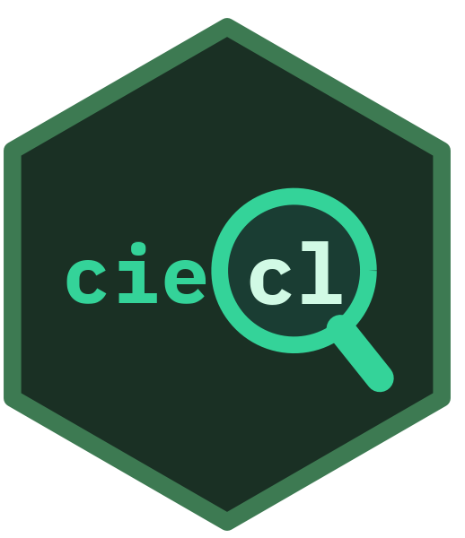

> **Language / Idioma:** **English** \|
> [Español](https://rodotasso.github.io/ciecl/articles/ciecl-es.html)

<!-- README.md is generated from README.Rmd. Please edit that file -->

# ciecl  

**Data Science for Public Health Group** \| University of Chile

<!-- badges: start -->

[](https://lifecycle.r-lib.org/articles/stages.html#stable)
[](https://CRAN.R-project.org/package=ciecl)
[](https://github.com/RodoTasso/ciecl/releases)
[](https://github.com/RodoTasso/ciecl/actions/workflows/r.yml)
[](https://cran.r-project.org/package=ciecl)
[](https://github.com/RodoTasso/ciecl/actions/workflows/test-coverage.yaml)
[](https://rodotasso.github.io/ciecl/)

<!-- badges: end -->

**Official Chilean ICD-10 Classification (CIE-10) for R**.

Specialized package for searching, validating, and analyzing ICD-10
codes in the Chilean context. Includes **39,877 codes** (categories and
subcategories) from the official MINSAL/DEIS v2018 catalog, with
optimized search, comorbidity calculation, and WHO ICD-11 API access.

## Purpose

`ciecl` facilitates working with ICD-10 codes in health research and
data analysis in Chile, eliminating the need to manually manipulate
Excel files and providing specialized tools for:

- Fast validation of diagnostic codes
- Error-tolerant search (fuzzy search)
- Automatic calculation of comorbidity indices (Charlson, Elixhauser)
- Optimized SQL queries over more than 39,000 codes
- Hierarchical expansion of categories to subcategories (e.g., E11 -\>
  E11.0, E11.1, …, E11.9)

## Why use ciecl

### Advantages:

1.  **Performance**: SQLite indexed database with 10-100x faster
    searches than Excel
2.  **Native integration**: Works directly in R without heavy external
    dependencies
3.  **Fuzzy search**: Finds “bacterial pneumonia” even if misspelled
    (tolerates typos)
4.  **Vectorized validation**: Processes thousands of codes in
    milliseconds
5.  **Automatic normalization**: Accepts E110, E11.0, e11.0
    interchangeably
6.  **No encoding errors**: XLSX files have issues with accents on
    different systems
7.  **Reproducibility**: Version-controlled ICD-10 catalog (doesn’t
    change between computers)
8.  **Predefined comorbidities**: Ready-to-use Charlson/Elixhauser
    mappings
9.  **ICD-11 API**: Direct access to updated international
    classification
10. **Smart cache**: Stores frequent queries for faster speed

### Comparative example:

``` r
# With XLSX (slow, manual, error-prone)
library(readxl)
cie10 <- read_excel("CIE-10.xlsx")
diabetes_codes <- cie10[grepl("diabetes", tolower(cie10$description)), ]

# With ciecl (fast, robust, cached)
library(ciecl)
diabetes_codes <- cie_search("diabetes")
```

## Comparison with similar packages

| Feature | ciecl | icd (CRAN) | comorbidity (CRAN) | touch (CRAN) |
|----|----|----|----|----|
| Official Chilean ICD-10 MINSAL/DEIS | **Yes** | No | No | No |
| Fuzzy search (Jaro-Winkler) | **Yes** | No | No | No |
| Chilean medical abbreviations (IAM, ACV, EPOC) | **Yes** | No | No | No |
| Charlson/Elixhauser comorbidities | Yes | Yes | **Yes** | No |
| WHO ICD-11 API | **Yes** | No | No | No |
| SQLite cache with FTS5 | **Yes** | No | No | No |
| Local Chilean adaptation | **Yes** | USA/generic only | No | USA only (ICD-10-CM) |

The ICD-10 codes included in `ciecl` are established by Decree 356/2017
of Chile’s Ministry of Health as the official disease classification
system. The dataset is not modifiable by the package — it can only be
updated by institutional decree from MINSAL through DEIS.

## Main features

- **39,877 ICD-10 codes**: Complete official MINSAL/DEIS v2018 catalog
- **Fuzzy search**: Jaro-Winkler algorithm to tolerate spelling errors
- **Direct SQL**: Full database access for complex queries
- **Vectorization**: Processes thousands of codes simultaneously
- **SQLite cache**: Stores frequent results for instant queries
- **Comorbidities**: Validated Charlson and Elixhauser mappings
- **Hierarchical expansion**: Gets all subcodes from a category
- **ICD-11 API**: Search in updated international classification (WHO)
- **Minimal dependencies**: Only 8 required packages for core
  functionality

## Installation

### All platforms (Windows, macOS, Linux)

``` r
# From CRAN
install.packages("ciecl")

# From GitHub
# install.packages("pak")
pak::pak("RodoTasso/ciecl")

# Alternative with devtools
devtools::install_github("RodoTasso/ciecl")

# Full installation (includes optional packages)
pak::pak("RodoTasso/ciecl", dependencies = TRUE)
```

### System requirements by platform

#### Windows

No additional system dependencies required. Installation works directly.

#### macOS

Make sure you have Xcode Command Line Tools installed:

``` bash
xcode-select --install
```

#### Linux (Ubuntu/Debian)

``` bash
# Dependencies for compiling R packages
sudo apt-get update
sudo apt-get install -y \
  r-base-dev \
  libcurl4-openssl-dev \
  libssl-dev \
  libxml2-dev
```

**Note**: The package has **minimal dependencies** for core
functionality. Additional packages are only required for specific
functions.

## Quick start

``` r
library(ciecl)

# Exact search (supports multiple formats)
cie_lookup("E11.0")   # With dot
cie_lookup("E110")    # Without dot
cie_lookup("E11")     # Category only

# Vectorized - multiple codes
cie_lookup(c("E11.0", "I10", "Z00"))

# With complete formatted description
cie_lookup("E110", descripcion_completa = TRUE)

# Extract code from text with prefixes/suffixes (scalar code only)
cie_lookup("CIE:E11.0", extract = TRUE)       # Returns E11.0
cie_lookup("E11.0-confirmed", extract = TRUE) # Returns E11.0
cie_lookup("dx-G20", extract = TRUE)          # Returns G20
# Note: extract=TRUE only works with scalar codes, use FALSE for vectors

# Fuzzy search with typos
cie_search("diabetis mellitus")  # Finds "diabetes mellitus"

# Search by medical abbreviations (88 supported abbreviations)
cie_search("IAM")   # Acute Myocardial Infarction
cie_search("TBC")   # Tuberculosis
cie_search("DM2")   # Type 2 Diabetes Mellitus
cie_search("EPOC")  # Chronic Obstructive Pulmonary Disease
cie_search("HTA")   # Arterial Hypertension

# See all available abbreviations
cie_siglas()

# Direct SQL
cie10_sql("SELECT * FROM cie10 WHERE codigo LIKE 'E11%' LIMIT 3")

# Comorbidities (requires: install.packages("comorbidity"))
df %>% cie_comorbid(id = "patient", code = "diagnosis", map = "charlson")
```

## ICD-11 Configuration (optional)

To use `cie11_search()` and access the updated international
classification, you need free WHO credentials:

### Step 1: Get credentials

1.  Visit <https://icd.who.int/icdapi>
2.  Register with your email (free process)
3.  You will receive a `Client ID` and `Client Secret`

### Step 2: Configure in R

**Option A: Environment variable (recommended)**

Create a `.Renviron` file in your working directory or home:

``` r
# In .Renviron
ICD_API_KEY=your_client_id:your_client_secret
```

**Option B: In each session**

``` r
Sys.setenv(ICD_API_KEY = "your_client_id:your_client_secret")
```

### Step 3: Use ICD-11

``` r
library(ciecl)

# Search in ICD-11 (requires httr2)
cie11_search("diabetes mellitus", max_results = 5)
#> # A tibble: 5 x 3
#>   code    title                                    chapter
#>   <chr>   <chr>                                    <chr>
#> 1 5A14    Diabetes mellitus, unspecified type      05
#> 2 5A11    Type 2 diabetes mellitus                 05
#> 3 5A10    Type 1 diabetes mellitus                 05
```

**Note**: ICD-11 is optional. All core functions (ICD-10) work without
an API key.

## Data

Based on official **ICD-10 MINSAL/DEIS v2018** catalog:

- **Source**: [Department of Health Statistics and Information
  (DEIS)](https://deis.minsal.cl)
- **FIC Chile Center**: <https://deis.minsal.cl/centrofic/>
- **Documents repository**: <https://deis.minsal.cl>

ICD-10 data is for public use according to [Decree 356 Exempt
(2017)](https://www.bcn.cl/leychile/navegar?i=1112064) from the Ministry
of Health establishing official ICD-10 use in Chile.

## Contributing

Contributions are welcome:

- Report bugs at [GitHub
  Issues](https://github.com/RodoTasso/ciecl/issues)
- Suggest improvements or new features
- Submit pull requests

## License

MIT (package code) + ICD-10 MINSAL public use data

## Author

**Rodolfo Tasso Suazo** \| <rtasso@uchile.cl>

### Institutional Affiliation

<p align="center">


</p>

**Data Science for Public Health Group**<br> School of Public Health,
Faculty of Medicine<br> University of Chile

This package was developed as part of the work of the Data Science for
Public Health Group, dedicated to applying computational and statistical
methods to improve public health research in Chile.

## Links

- **Repository**: <https://github.com/RodoTasso/ciecl>
- **Report issues**: <https://github.com/RodoTasso/ciecl/issues>
- **DEIS MINSAL**: <https://deis.minsal.cl>
- **FIC Chile Center**: <https://deis.minsal.cl/centrofic/>
- **WHO ICD-11 API**: <https://icd.who.int/icdapi>
